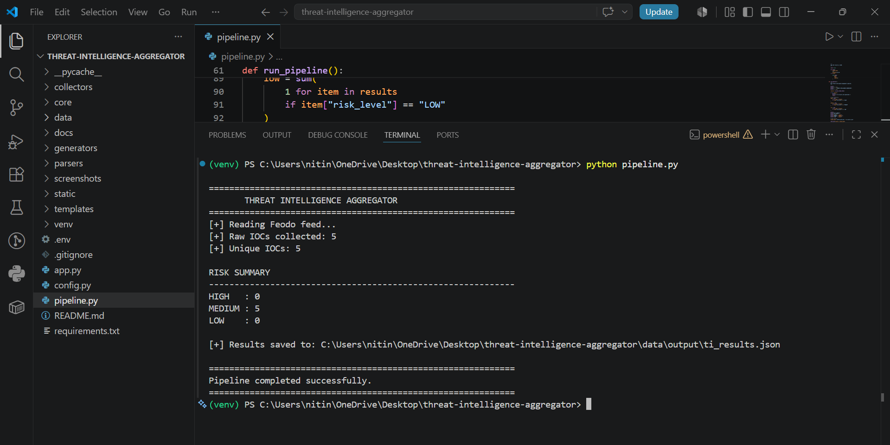
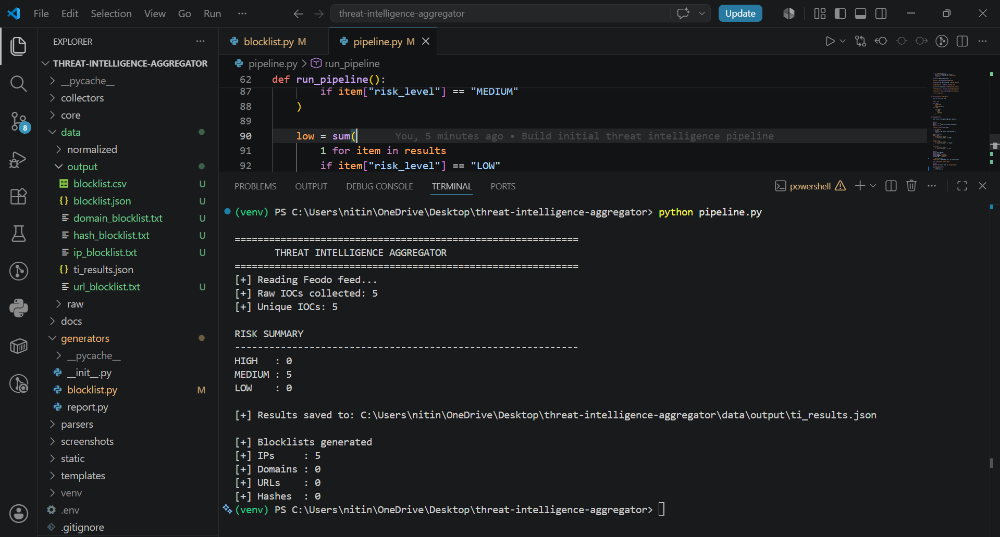
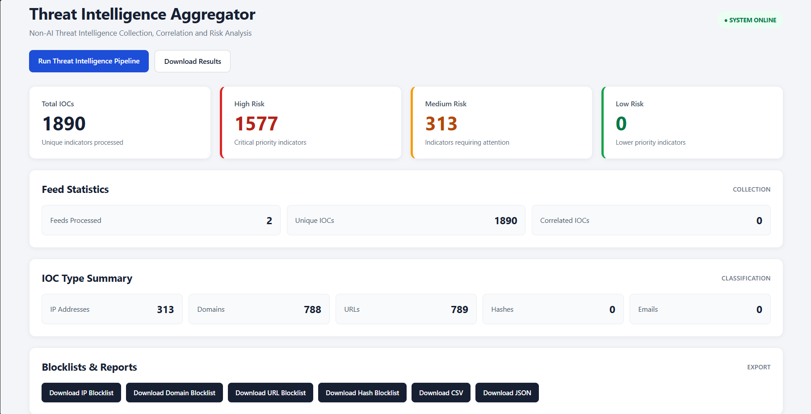
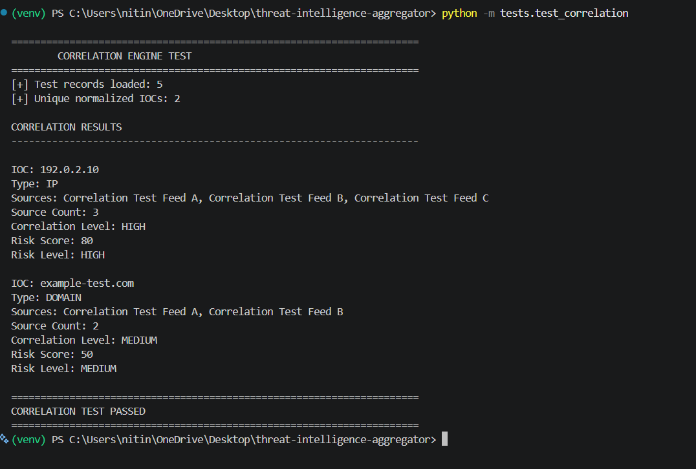
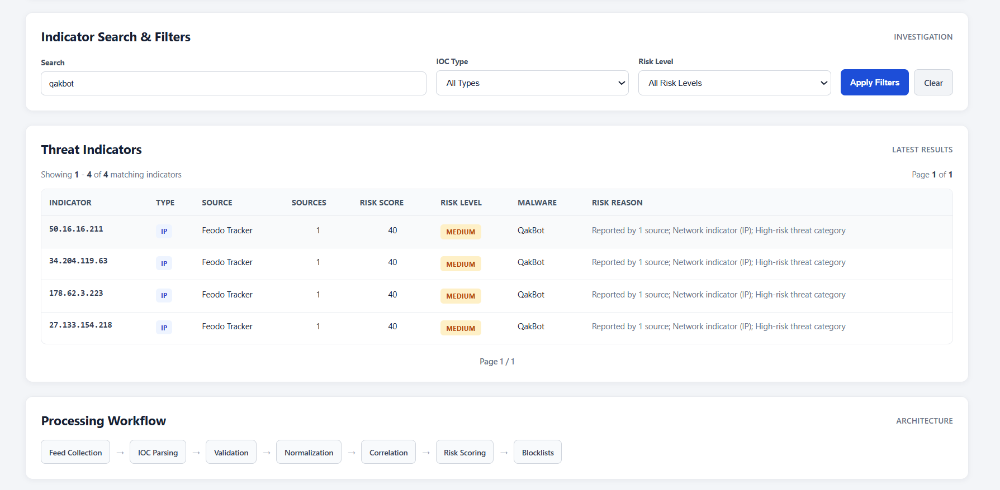
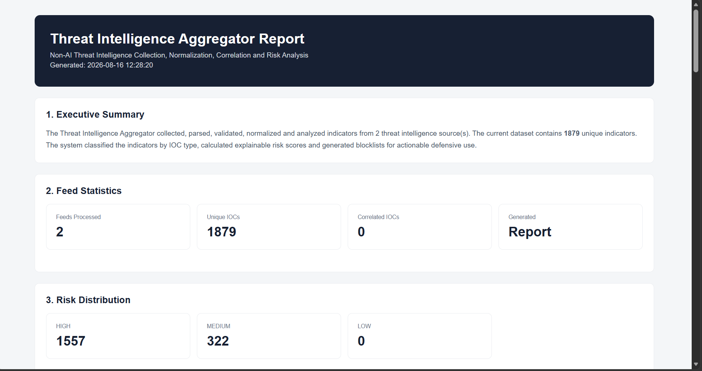
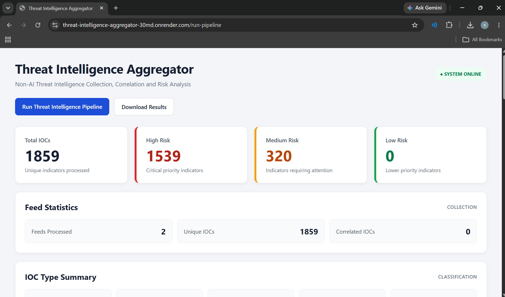

# Threat Intelligence Aggregator

A non-AI Threat Intelligence Aggregator built with Python and Flask for collecting, parsing, validating, normalizing, correlating, prioritizing, and exporting Indicators of Compromise (IOCs) from multiple threat intelligence feeds.

## Live Deployment

The Threat Intelligence Aggregator is deployed as a public Flask web application.

**Live Application:**

https://threat-intelligence-aggregator-30md.onrender.com

> Note: The application is deployed on Render's free tier and may take some time to wake after a period of inactivity.

## Project Overview

Security teams receive threat intelligence from multiple sources in different formats. Manually processing these feeds can be time-consuming and can lead to inconsistent IOC handling.

This project provides a defensive pipeline that:

- Collects threat intelligence from multiple feeds
- Parses IPs, domains, URLs, hashes, and email indicators
- Validates IOC formats
- Normalizes indicators
- Removes duplicates
- Correlates repeated indicators across sources
- Calculates explainable risk scores
- Generates actionable blocklists
- Produces CSV, JSON, TXT, and HTML outputs
- Provides a Flask-based web dashboard

## Architecture

```text
Threat Intelligence Feeds
          |
          v
   Feed Collection
          |
          v
      IOC Parsing
          |
          v
      Validation
          |
          v
    Normalization
          |
          v
     Correlation
          |
          v
     Risk Scoring
          |
          v
   Blocklist Generation
          |
          v
      Reporting
          |
          v
    Flask Dashboard
```

## Threat Intelligence Sources

The current implementation supports:

- Feodo Tracker
- Phishunt
- URLhaus integration structure with optional Auth-Key support
- Local TXT, CSV, and JSON feeds

Live feed files are downloaded during runtime and are intentionally excluded from the Git repository.

## Features

### IOC Detection

Supported IOC types include:

- IPv4 / IPv6 addresses
- Domains
- URLs
- MD5
- SHA1
- SHA256
- Email addresses

Example indicators:

```text
8.8.8.8
example.com
https://example.com
d41d8cd98f00b204e9800998ecf8427e
test@example.com
```

### IOC Validation

Indicators are validated before entering the processing pipeline.

Invalid or unsupported values are discarded.

### Normalization

Indicators are standardized before correlation.

The system:

- Removes unnecessary whitespace
- Normalizes case where appropriate
- Normalizes URLs
- Removes duplicate indicators
- Preserves reporting-source information

### Cross-Feed Correlation

Indicators appearing in multiple sources are identified.

Example:

```text
Feed A ----\
Feed B -----+----> Same IOC ---> Correlated
Feed C ----/
```

Correlation levels:

```text
1 source     -> LOW
2 sources    -> MEDIUM
3+ sources   -> HIGH
```

A reproducible correlation test fixture is included in the `tests` directory.

### Risk Scoring

Risk scores are explainable and based on factors such as:

- Number of reporting sources
- IOC type
- Confidence
- Threat category

The system produces:

```text
LOW
MEDIUM
HIGH
```

Every scored IOC can also contain reasons explaining how the score was derived.

### Blocklist Generation

The application generates:

```text
IP blocklist
Domain blocklist
URL blocklist
Hash blocklist
```

Supported formats:

```text
TXT
CSV
JSON
```

### Threat Intelligence Reporting

The system automatically generates an HTML report containing:

- Executive summary
- Feed statistics
- IOC statistics
- Risk distribution
- IOC type distribution
- Correlation results
- Highest-risk indicators
- Blocklist summary
- Processing methodology
- Conclusion

### Web Dashboard

The Flask dashboard provides:

- IOC statistics
- Risk distribution
- Feed statistics
- IOC type distribution
- Search
- IOC type filtering
- Risk filtering
- Pagination
- Blocklist downloads
- JSON result download
- Threat intelligence report download
- Pipeline execution button
- Processing workflow visualization

## Project Structure

```text
threat-intelligence-aggregator/
|
├── collectors/
│   ├── __init__.py
│   ├── feodo.py
│   ├── http_downloader.py
│   ├── phishunt.py
│   ├── threatfox.py
│   └── urlhaus.py
|
├── core/
│   ├── __init__.py
│   ├── correlator.py
│   ├── normalizer.py
│   ├── risk_scoring.py
│   └── validator.py
|
├── data/
│   ├── output/
│   └── raw/
|
├── generators/
│   ├── __init__.py
│   ├── blocklist.py
│   └── report.py
|
├── parsers/
│   ├── __init__.py
│   ├── csv_parser.py
│   ├── feodo_parser.py
│   ├── json_parser.py
│   ├── phishunt_parser.py
│   └── txt_parser.py
|
├── screenshots/
│   ├── 01_pipeline_success.png
│   ├── 02_blocklist_generation.png
│   ├── 03_dashboard.png
│   ├── 04_correlation_test.png
│   ├── 05_dashboard_filters.png
│   └── 06_threat_intelligence_report.png
|
├── static/
│   └── style.css
|
├── templates/
│   └── index.html
|
├── tests/
│   ├── __init__.py
│   ├── correlation_test.json
│   └── test_correlation.py
|
├── app.py
├── config.py
├── pipeline.py
├── requirements.txt
├── .gitignore
└── README.md
```

## Technologies Used

- Python 3
- Flask
- Requests
- Pandas
- python-dotenv
- Regular Expressions
- CSV
- JSON
- IP address validation
- HTML
- CSS
- Git
- GitHub

## Installation

### 1. Clone the Repository

```bash
git clone https://github.com/NitinSukthe-G/threat-intelligence-aggregator.git
cd threat-intelligence-aggregator
```

### 2. Create a Virtual Environment

#### Windows

```powershell
python -m venv venv
```

Activate it:

```powershell
venv\Scripts\activate
```

### 3. Install Dependencies

```powershell
pip install -r requirements.txt
```

## Configuration

Create a `.env` file in the project root if optional API credentials are required.

Example:

```text
URLHAUS_AUTH_KEY=
```

Never commit `.env` to GitHub.

The repository already contains a `.gitignore` rule to protect environment variables and local runtime files.

## Running the Pipeline

Run:

```powershell
python pipeline.py
```

The pipeline performs:

```text
Feed Collection
      ↓
IOC Parsing
      ↓
Validation
      ↓
Normalization
      ↓
Correlation
      ↓
Risk Scoring
      ↓
Blocklist Generation
      ↓
Report Generation
```

Example runtime output:

```text
THREAT INTELLIGENCE AGGREGATOR

[FEED] Feodo Tracker
[+] Feodo records: 5

[FEED] Phishunt
[+] Phishunt records: ...

[+] Total raw IOCs: ...
[+] Unique IOCs: ...
[+] Correlated IOCs: ...

RISK SUMMARY
HIGH   : ...
MEDIUM : ...
LOW    : ...

[+] Blocklists generated
[+] Threat intelligence report generated

Pipeline completed successfully.
```

The exact numbers vary because threat intelligence feeds are dynamic.

## Running the Dashboard

Run:

```powershell
python app.py
```

Open:

```text
http://127.0.0.1:5000
```

The dashboard provides:

```text
IOC Statistics
Risk Distribution
Feed Statistics
IOC Type Summary
Search
Filtering
Pagination
Blocklist Downloads
Report Download
Pipeline Execution
```

## Testing the Correlation Engine

Run:

```powershell
python -m tests.test_correlation
```

The test verifies that the correlation engine can identify indicators appearing across multiple sources.

Expected concepts:

```text
192.0.2.10
3 sources
HIGH correlation
```

and:

```text
example-test.com
2 sources
MEDIUM correlation
```

The test data uses reserved/example indicators and is clearly separated from the live threat-intelligence feeds.

## Output Files

The application generates outputs under:

```text
data/output/
```

Typical outputs include:

```text
ti_results.json
ip_blocklist.txt
domain_blocklist.txt
url_blocklist.txt
hash_blocklist.txt
blocklist.csv
blocklist.json
threat_intelligence_report.html
```

## Blocklist Workflow

```text
Normalized IOCs
       |
       v
Correlation
       |
       v
Risk Scoring
       |
       v
Medium + High Risk
       |
       +----> IP Blocklist
       |
       +----> Domain Blocklist
       |
       +----> URL Blocklist
       |
       +----> Hash Blocklist
```

These outputs are intended as defensive threat-intelligence artifacts and should be reviewed before deployment into production security controls.

## Example Results

A recent development run processed thousands of IOC records across multiple threat intelligence sources and produced:

- IP indicators
- Domain indicators
- URL indicators
- Risk classifications
- Blocklists
- JSON/CSV results
- HTML threat intelligence report

Because the external feeds are dynamic, the exact numbers will change between executions.

## Screenshots

### 1. Pipeline Execution



### 2. Blocklist Generation



### 3. Threat Intelligence Dashboard



### 4. Correlation Engine Test



### 5. Dashboard Search and Filters



### 6. Threat Intelligence Report



### 7. Deployed Application



---

## Security Considerations

- API keys are loaded through environment variables.
- `.env` is excluded from version control.
- Live threat-intelligence feed files are excluded from the repository.
- Indicators are treated as data and are never executed by the application.
- External feed data should be treated as untrusted input.
- Generated blocklists should be reviewed before deployment into production security infrastructure.
- The application is intended for defensive cybersecurity and threat-intelligence analysis.

## Limitations

- Threat-feed availability depends on external providers.
- Feed schemas may change over time.
- Cross-feed correlation depends on actual IOC overlap.
- Real-world feeds may produce zero correlated indicators during some runs.
- Current persistence is file-based rather than database-backed.
- The risk-scoring model is rule-based and intentionally non-AI.
- URLhaus integration requires the appropriate authentication configuration when used.

## Future Improvements

Possible future enhancements include:

- STIX/TAXII support
- Scheduled feed collection
- SQLite/PostgreSQL storage
- SIEM integration
- Authentication
- Role-based access control
- Additional threat-intelligence feeds
- Feed health monitoring
- REST API endpoints
- Background task scheduling
- Configurable scoring rules
- Automated alerting
- Historical IOC tracking
- IOC expiration management

## Project Objective

The primary objective of this project is to demonstrate a practical SOC / Blue Team workflow for turning heterogeneous threat intelligence feeds into normalized, correlated, prioritized, and actionable defensive intelligence.

The project demonstrates how security teams can automate repetitive threat-intelligence processing while maintaining explainable, rule-based decision making.

## Learning Outcomes

This project provided practical experience with:

- IOC extraction
- IOC validation
- IOC normalization
- Threat-feed ingestion
- Multi-source correlation
- Rule-based risk scoring
- Blocklist generation
- Threat-intelligence reporting
- Flask dashboard development
- Defensive security automation
- Git and GitHub workflow
- Testing and documentation

## License

This project was developed as an internship project for educational and defensive cybersecurity purposes.
